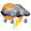
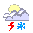
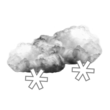
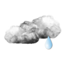
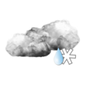
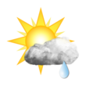
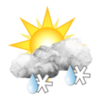
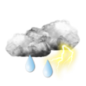
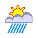

     

 

          

         

 

http://www.blt.se/kultur-noje/hor-koltrast-harma-ambulans/

 

http://prognoza.hr/wsymbols.html

 

Spara

Spara

Spara

Spara

Spara

Spara

Spara

Spara

Spara

Spara

Spara

Spara
